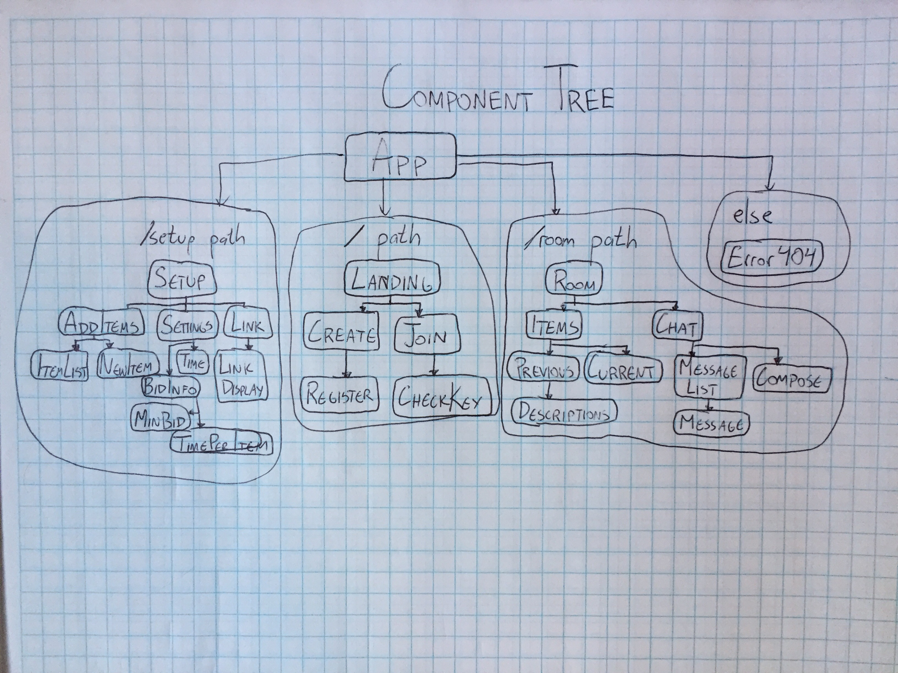
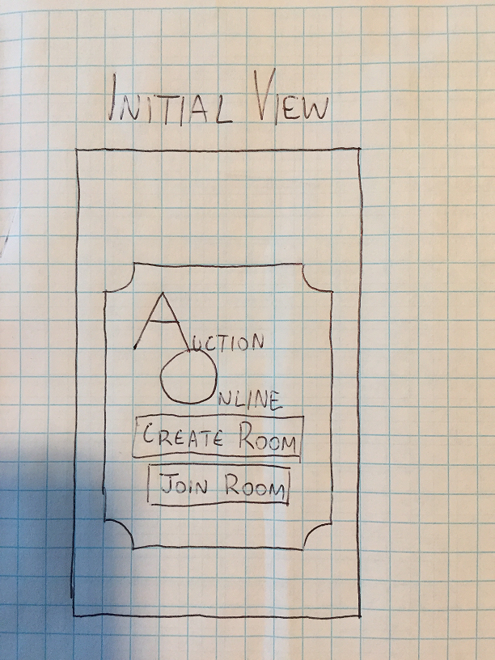
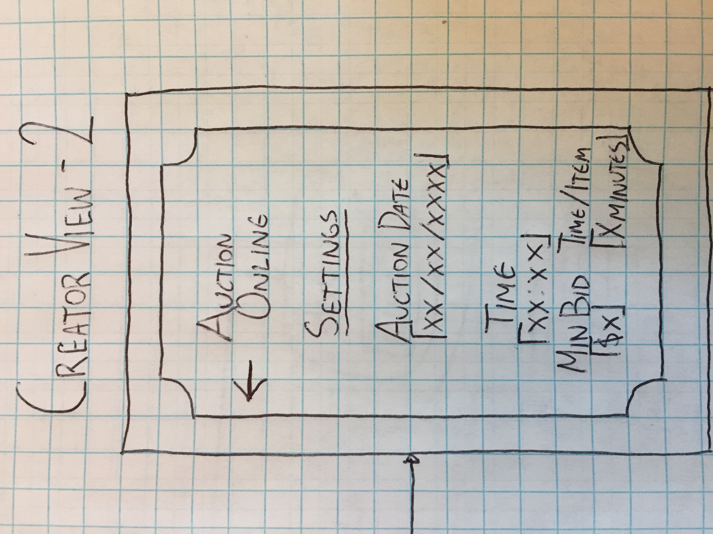
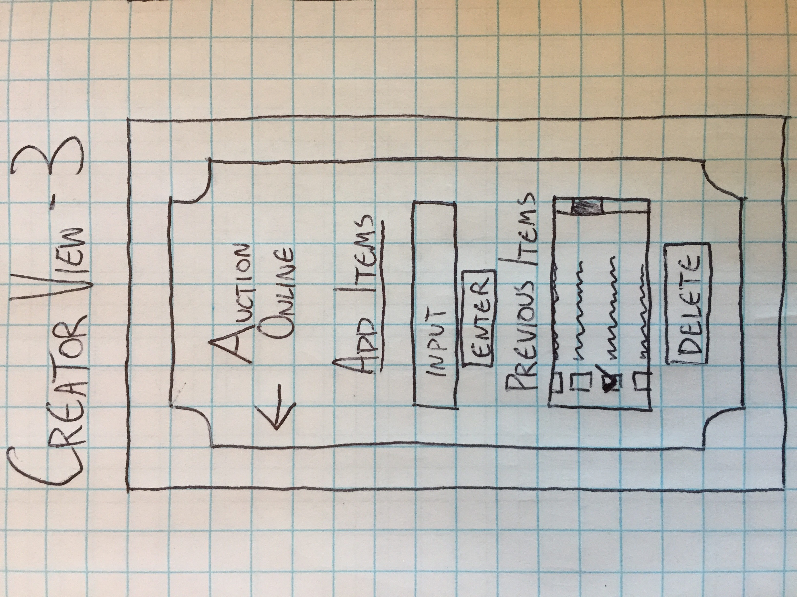
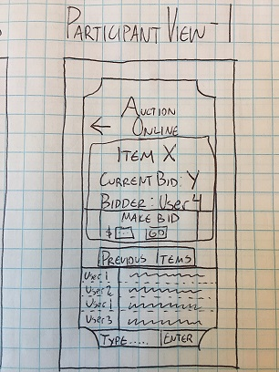
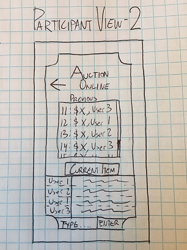

# Auction Online - Planning Phase

### Created by **Travis Toal**, 5/2/19

## Description (current)
* _The purpose of this app is to simulate an online auction, allowing many users to simultaneously view the application and make 'bids' on items. The minimum viable product includes a time-dependent auction process, which updates in real-time to show the highest bid and bidder, and a live-chat functionality. This project will use Redux to keep domain data and application state, which will be fed to / pulled from Firebase._
* _The stretch goals include refactoring the application for mobile use in React Native, and the inclusion of a Payment Gateway API such as Stripe to make the auctions functional._

## Planning

#### Component Tree

#### Sketching

Landing Page

Creator View 1

Creator View 2

Creator View 3

Participant View 1

Participant View 2

##### Users

* _For the most part, I'm assuming my audience is widely tech-illiterate, and as such want to make the app simple. The purpose of the app is to be as intuitive (the least click-heavy) as possible. No more than 3 or 4 buttons per view, minimal routes with maximum functionality. Like a duck, I want the app to be pretty and smooth on the surface, and busy under the water._

* Unknown / Pageload
  * _On the initial visit, users will be greeted with the option to register an event, or enter a key to join an existing event, leading to the Creator or Participant views._
* Auction Creators
  * _Auction Creators should be able to initialize an event, creating a key of some sort stored in persistent state that will be the index of all auction items for that event._
  * _Auction Creators should be able to input as many items as they wish, which will be stored in persistent state underneath their specific key._
  * _Auction Creators can determine the time and length of the auctions, as well as any minimum bids required, and control access to the auction with the distribution of their key._
* Auction Participants
  * _Auction Participants will be able to use that key to enter the 'auction room' at the allotted time, at which point they will be prompted to enter a username, which will be required for them to bid._
  * _Participants will be able to join a live chat._
  * _The order of the items for bid will be randomized once, before bidding starts._
  * _The items in the auction will be put up for bid one at a time, for a duration determined by the Creators._
  * _During that item's bidding period, the current highest bid will be displayed, along with the bidder's username, with a default '$0, Current bidder: No bids yet'._
  * _Users can input a bid. The program will check if the bid is higher than the current highest bid, and if so, will update the screen with the new bid and bidder's username._
  * _After the bidding period ends, the next item for bid will be displayed, perhaps after a buffer period to allow participants to prepare, and all previous items will be displayed in their finalized form._

#### 8-9AM
* _Read the 'Thinking In React' article on planning, mocking, creating static pages._
* _Begin planning the user experience based on their role in the auction process._

#### 9-10AM
* _Plan logic for participant use._
* _Plan shape of state / data._
* _Sketch out initial page views_

#### 10-11AM
* _Continue sketching page views._
* _Eat snack_

#### 11AM-Noon
* _Draw initial component tree._
* _Begin adding React code_

#### 12-1PM
* _Continue sketching page views_

#### 1-4PM
* _Build initial static page_

# Development Notes
* _I already have a lot of components planned, but I'm not sure about my route planning. I have three set paths, and a 404 path, but I'm wondering if I should be adding new paths for the NewItems and Settings components, and if I require even MORE components for each of those. I probably will need more, but I'll see that when I get to that point._

# State Management

* _I'm planning on using Redux and sending the store to Firebase._
* _There will be local application state checking the users' credentials, keeping them on the correct route._
* _Once in their respective route, there will be state information passed down from Firebase:_
  * _Auction creators will modify the ItemList information which will need to communicate with NewItem, so their state should reside in AddItems. They will also determine the time and specifications of the auction, which will reside in Settings, and be changed by its components. The Link component will receive a random ID from Firebase on creation which will be the key to enter the room._

### Setup/Installation Requirements
* Open your preferred browser
* To view the code, copy / paste
  https://github.com/travisty12/auction-online
* Make sure you're in your Desktop directory
(cd ~/Desktop)
* Run the following command to clone the template
* `git clone https://travisty12/auction-online`
* Open your terminal and navigate to the auction-online directory
(cd auction-online)
* Once in your terminal and proper directory run the command
* `npm install` (provided you are free of errors continue and run the next command)
* `npm run start` (should automatically open in your default browser)
*  This will result in running on a local host
* To run unit testing on the reducers, run the command
* `npm run test`

## Known Bugs
_No known bugs as of 5/3/19_

## List of Technologies Used

### License

_This software is licensed under the ISC license_

Copyright (c) 2019
**_Travis Toal_**  
